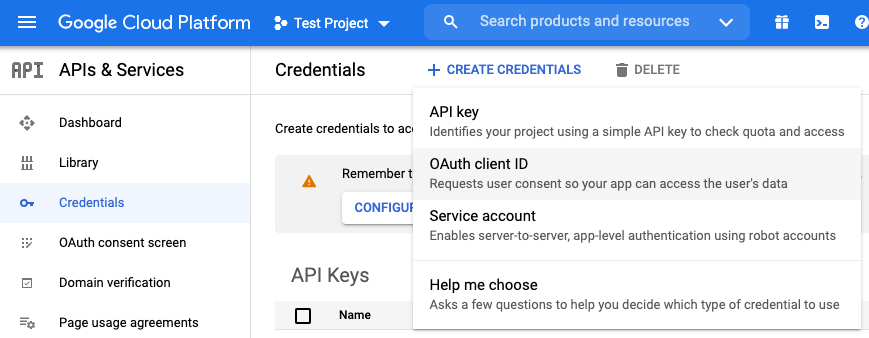
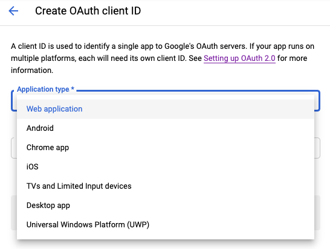
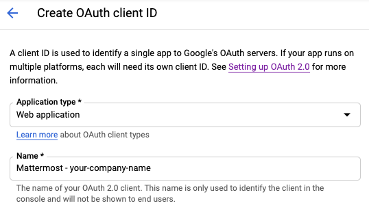
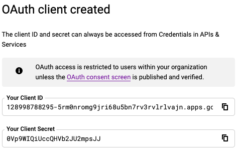

# Google Single Sign-On

## Migrating from OAuth 2.0 to OpenID Connect

OAuth 2.0 is being deprecated and replaced by OpenID Connect. Refer to the product documentation to [convert your existing OAuth configuration](https://docs.mattermost.com/cloud/cloud-administration/converting-oauth-2.0-to-openid-connect.html) for Google Apps to the OpenID Connect standard.

## Configuring Google Apps as a Single Sign-On (SSO) service

Follow these steps to configure Mattermost to use Google as a Single Sign-on (SSO) service for team creation, account creation, and sign-in.

**Note:** The [Google People API](https://developers.google.com/people) has replaced the Google+ API, which was deprecated by Google as of March 7th, 2019 [per their notice](https://developers.google.com/+/api-shutdown).

### Step 1: Create OpenID Connect project in Google API Manager

1. Go to [Google Cloud Platform](https://console.developers.google.com).

2. Select **Credentials** in the left-hand sidebar.

3. Select **Create Credentials**, then select **OAuth client ID**.

4. Select the **Web application** as the application type.

5. Enter `Mattermost-<your-company-name>` as the **Name**, replacing <your-company-name> with the name of your organization.

6. Under **Authorized redirect URIs, select Add URL, then enter `{your-mattermost-url}/signup/google/complete`. For example: `http://localhost:8065/signup/google/complete`.

7. Select **Create**.

8. Copy and paste the **Your Client ID** and **Your Client Secret** values to a temporary location. You will enter these values in the Mattermost System Console.

### Step 2: Enable Google People API

Go to the [Google People API](https://console.developers.google.com/apis/api/plus/overview), then select **Enable** in the header. This might take a few minutes to propagate through Google's systems.

### Step 3: Configure Mattermost for Google Apps SSO

1. Log in to Mattermost, then go to **System Console > Authentication > OpenID Connect**.

2. Select **Google Apps** as the service provider.

3. The **Discovery Endpoint** for OpenID Connect with Google Apps is prepopulated with ``https://accounts.google.com/.well-known/openid-configuration``.

4. Paste in the **Client ID** from Google in Mattermost.

5. Paste in the **Client Secret** from Google in Mattermost.

6. Select **Save**.

7. Restart your Mattermost server to see the changes take effect.
